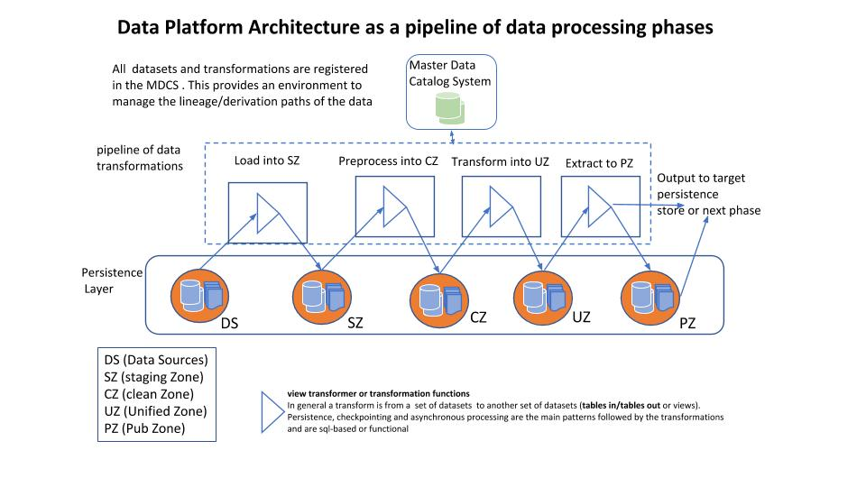
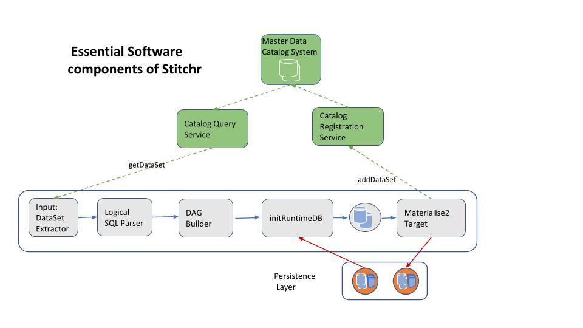
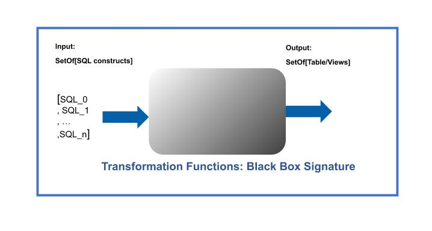
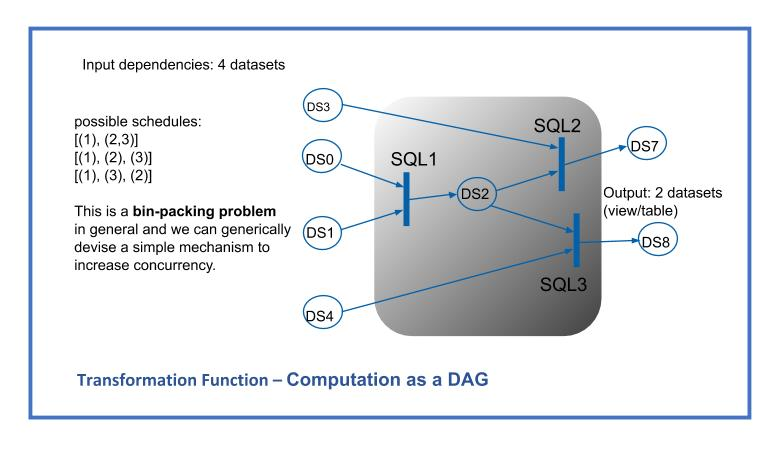

 # (Data)Stitchr #

## What is (Data)Stitchr? ###

DataStitchr or Stitchr is a tool that helps move and transform data along all phases of a data processing pipeline.
It can be deployed at any place in the pipeline to help in the data loading, transformation and extraction process. 

The objective is to develop an open, extensible  and "simple-to-use" tool for data engineers.

The focus is first on simplicity of use through "stitching" SQL constructs in a DAG of data transformations and derivations.
The use cases we intend to handle include (but are not limited to)

1. File based SQL. In this case data sources and data targets are files. 
2. A database engine is the source and target and data objects are Table, Views, Temporary tables, etc.
3. Data sources and targets are heterogeneous.

Currently, the code handles use cases 1 and 2. While use case 3's functionality can be easily added, performance and optimization is another story.
Furthermore the focus of this iteration is to model all transformations in SQL.

Stitchr is built as an application based and using [Apache Spark](https://spark.apache.org/ "Spark").

## Preamble Jargon

Data objects in Stitchr are referred to as DataSets. Currently, a DataSet is either a file or an (RDBMS) database object such as a table or a view.
Each DataSet is associated with data persistence containers or persistence zone. The source persistence zone is the main association of the data object and we associate the transformation to a target persistence container to establish the destination persistence of the transformed data object.
A persistence zone or container  may be an Amazon S3 folder, Google Cloud Storage, HDFS, etc or a database such as postgres.
DataSets exist in containers and are manipulated and transformed and potentially new objects generated and saved in target persistence containers.


Code logic is driven by metadata stored in the Master Data Catalog System or simple the Data Catalog (DC). The DC holds all metadata specifying the objects and their association with the persistence containers.
 DataSets are either self-describing or are described with a schema definition stored in the data catalog.

DataSets can be concrete and hold information of what we refer to as primitive-base objects (stored in a container) or derived objects (specified by a query). 
    
Base DataSet objects are directly evaluated and assume that they do not have unresolved dependencies. Derived DataSet objects depend on other objects and this is captured in the query attribute associated with the DataSet. The query is representing a data transformation, which could be a pass thru and is processed into a DAG of dependent objects to establish the (recursive) sequence of basic dependent objects instantiations towards the instantiation of the target derived DataSet object.


The process has 2 major steps: an initialization step in the `InSessionDB` (effectively Spark) and a materialization step to a target persistence container if required. The simplest function would be to move objects from source to destination containers, with the InSessionDB instantiation as illustrated above.

As expected we inherit from Spark's APIs and do not re-invent the wheel.

## What Features do we currently support

### Supported Persistence Containers
* objects stores such as S3 and GS
* HDFS
* files (not in cluster mode)
* JDBC: here we extend on Spark's parallel JDBC support and make it more generic. One specifies the partition key column (currently assumed to be Long) but does not need to provide a lower and upper limit. 
We do not compute the min/max but resort to runtime round robin bucketing based on the level of specified parallelism, and wrap the driver accordingly.


### Data Movement Use Cases ###
#### Move a group of Data Objects from a Source Container to a Destination Container
* Move a group of DataSets

    ```$STITCHR_ROOT/bash/runMoveDatSetGroup.sh```
     
takes one argument which is the name of the group to run. The system reads the set of DataSet objects associated with the group and moves them to the target destination. Finally it will register or update the registry with the new moved objects.
   
* Move a list of object references
  
    ``` $STITCHR_ROOT/bash/runMoveDatSetList.sh ```

is passed a comma-delimited list of object references and performs the same function of moving those objects to individually specified target containers. All of that is supported by registering the proper metadata information in the DC registry.

The basic entry point for moving a data object is in `com.stitchr.app.DataMoveService` with
```
// ql is a list of references to DataSet
def moveDataSetList(ql: List[String]): Unit = 
       // instantiate the derived views
       ql.foldLeft()(
           (_, next) => {
             getDataSet(next).move2Target
           }
       )
     }
```

``` $STITCHR_ROOT/bash/runExamples.sh```
runs a battery of tests moving a group of objects as well as a list of objects

#### Move objects from a JDBC source persistence by specifying the object as a select query.

This is supported by providing the select query in the  DataSet.query attribute and tagging the DataSet.mode as "base". The system will then push dpwn the query to the source JDBC persistence and return a handle to the result initialized in the runtime in session database. The materialization of the result to any target can be associated as well.
### DataSet object and Data Persistence container registration 
     
#### Automated Registration of a set of DataSet from a JDBC persistence source

This is supported through `com.stitchr.app.AutoRegisterService`. 

Given that you register the data persistence container information in the DC data_persistence table, invoking this function will pull the metadata associated with the tables/views in the persistence container and auto-register them in the Data Catalog.
The scala script 

```$STITCHR_ROOT/app/scripts/testSchemaDiscovery.scala``` 

can be invoked from an interactive spark-shell to demo this feature.

#### Registration of DataSet and DataPersistence with Json input
This is supported with getters and putters associated with the DataSet, DataPersistence and Schema in the RegistryService. 
An Example is provided in `$STITCHR_ROOR/app/scripts/testJson.scala` and associated functions are found in `com.stitchr.core.registry.RegistryService`, 
such as `putJsonDataset` and `putJsonDataPersistence` and 

An Example Json DataSet object is
```
{
"id":-1,
"object_ref":"date_dim_3,
"format":"pipeDelimited",
"storage_type":"file",
"mode":"base",
"container":"demo/data/tpcds",
"object_type":"file",
"object_name":"date_dim",
"query":"date_dim.dat",
"partition_key":null,
"number_partitions":1,
"schema_id":8,
"data_persistence_src_id":3,
"data_persistence_dest_id":0
}
```

specifying -1 for id means it is a new entry and the systems adds a sequence id to the new object. If the object already exists the operation is to update the entry (upsert). Note that `object_ref` is `object_name_data`_`persistence_src_id`.

A similar format (with the attributes of the data persistence container) is used to add a new container object. For a schema spec a Json array of schema_columns is generated and passed to the call.

The api calls are
```
com.stitchr.core.registry.RegistryService.putJsonDataset
com.stitchr.core.registry.RegistryService.putJsonDataPersistence
com.stitchr.core.registry.RegistryService.putJsonSchema
```
Those call 
```
com.stitchr.core.api.DataSetApi.Implicits.upsertDataset
com.stitchr.core.api.DataPersistenceApi.Implicits.registerDataPersistence
com.stitchr.core.api.DataSetSchemaApi.registerDataSetSchema
```
Corresponding calls to generate Json strings out of the different objects (DataSet, DataPersistence and Schema Structure) are
```
com.stitchr.core.registry.RegistryService.getJsonDataset
com.stitchr.core.registry.RegistryService.getJsonDataPersistence
com.stitchr.core.registry.RegistryService.getJsonSchema
```

### Data Transformation 
In the current version, The constraint is that all objects that we transform come from the same source persistence layer. This constraint will be removed in upcoming versions so that one could use federated queries. 
The constraint right now is more tied to keep the complexity burden on the user low. To enable it properly we need to, either constrain the object references globally or assume the query writer can specify object references across different persistence containers.
This would put an extra burden on the developer of such queries as we would need to introduce template support for query rewrites (with tolls such as JinJa). 
We do use Jinja in a very specific case and constrain the query writers to always alias the main table/view objects and enclose the dependency objects with `{{ }}`  (such as `{{ person }} as p`)
 
Taking into account the above restriction, any transformation that can be supported through (Spark)SQL can be specified. This covers Use cases 1 and 2 we outlined in the overview section.
 We are also working on adding UDF support through the Data Catalog metadata. 

### Miscelaneous Features
#### Tracking run_time
The parameter `global.addRunTimeRef` from global.properties when set to true implies adding a column `run_time_ref` of type timestamp to all objects. 
It holds a session based timestamp which enables to compare the data moved during a session. This is strictly __EXPERIMENTAL__ as it has implications on the queries that are attached to the DataSet. 
#### Tracking incremental changes or reloading
The way data is moved is controlled globally at runtime using the parameter `global.defaultWriteMode`. If it is set to append then data is added otherwise it is a full reload (overwrite).

## Stitchr Architecture and Patterns ##

### where does it fit
Data loading, transformation, integration and extraction is based on computational and data processing patterns around  composable functional transformations, lazy evaluation and  immutable data. 
The DataStitchr (or just Stitchr) architecture is viewed as a set of data transformations from a data  zone to another zone, going though any intermediate and necessary persistence zones. 
It can serve as the tool used to implement any of the data processing phases in a data platform.



We decided to base this implementation around well-established distributed data processing features of  [Apache Spark](https://spark.apache.org/ "Spark").

### Software Components
The main software components are illustrated below



and are as follows:

* Input: DataSet Extractor → service to pull the (SQL) Transformer associated with the targeted DataSet
* Logical SQL Parser → parses and extracts the dependencies from the Transformation function if any (uses the Spark SQL parser) 
* DAG Builder → builds the dependency set recursively down to all base DataSets (simple emi-naive transitive closure on the dependencies)
* InitRuntimeDB Service → executes the instantiation of all dependencies as well as the target set as abstractions (DataFrames and Tables) in the Spark internal session-based DB
* materilise2Target Service → physically materialising the target object in the associated target persistence container
* Catalog Query Service → interface api to the MDC to retrieve metadata about DataSets, DataSetPersistence and DataSetSchema among other services
* Catalog Registration Service→ interface api to the MDC to register or update DataSets and other artifacts as they are created or modified

### Data Transformation Patterns ###
Stitchr relies on generating a DAG of data processing steps to derive the expected output DataSets. 
The patterns for the different transformations are simple and follow a well-defined and uniform set of transformations steps that we elaborate on next. 


The underlying technical stack of Spark is very well tuned for such an application architecture. 
The basis is that transformation functions have a well-defined (and well-designed) interface for input and output and can be composed in a computational asynchronous graph, with plug and play capabilities. Outputs of different transformation functions (or transformers) can be bundled together to be the input of the next function. In this way, functions become the core components in the graph.

A black box view is that, given a set of SQL constructs applied on a set of base "sql objects" (tables/view abstracted artifacts), the output is a set of abstracted "sql objects."



Simple transformations examples are direct data moves or simple constraint checking as illustrated below as a sql join transformation.


More complex manipulation as illustrated here takes a set of input artifacts applies multi step sql transforms resulting with a set of outputs.


In summary, all your data objects are mapped to tables or views and nested SQL constructs are logically parsed to determine dependencies.
The derivation service applies the computations in the order of dependencies (following a DAG structure built as a table of edges).
The derived objects can be views, tables or temporary tables and are configuration based through a metadata registry.

In the current version, at each stage of the flow, the derivation works sequentially through a list of objects that can be instantiated (obviously using distributed processing on each object), and future versions will be extended to handle  concurrent derivation of independent objects.
The concurrent derivation of interdependent objects can be mapped to a bin packing problem on computational resources.



One can run the transformation DAG in different ways: the simplest is purely sequential following dependencies. But one can easily observe that a bin-packing problem that can be optimized at run time with threads and parallel/pipeline processing. While Spark does not intrinsically provide us with bin-packing capabilities, we will extend Stitchr to enable parallel processing of large sets of small files; decreasing the overhead of startup and enabling full pipeline processing on top of the distributed processing capabilities of spark.

## How to setup and demo the tool? ###

* Configuration
    
    covered by 
    ```$STITCHR_ROOT/demo/config/default.properties```
    
    
* Dependencies
   
        needs Spark 2.4 and Scala 2.11 installed. Although the system has been tested to work on Spark 2.2.3
    
* How to run the demo

    Place the data under `demo/data/tpcd` (downloaded and unzipped from [stitchr demo data](https://github.com/nhachem/stitchr-demo "stitchr-demo"))
    
    Edit the `bash/stitchr_env.sh` file and source it. This will setup the references to file-based registry objects, data folder and root directory of the code. Specifically     
```  
  export STITCHR_ROOT=<path to code base>
  export USER_ROOT="<user home>"
  export USER_PERSIST_ROOT="<usually hdfs>"
  export CONFIG_DIR="<path to where the config directory is>"
  export DATA_DIR="<path-to-root--data directory>" ## usually $USER_PERSIST_ROOT/data/...
  export REGISTRY_DIR="<path to where the registry directory is>"
  export baseRegistryFolder=$REGISTRY_DIR/registry/
  export baseConfigFolder=$CONFIG_DIR/config/
  ## using tpcds generated data
  export baseDataFolder=$DATA_DIR/tpcds/ ## for the demo
  export VERSION=<current version>
  export MASTER=local[4] ## set to yarn or master url in a cluster mode
  Issue: we add the user/pwd of data persistence zones to the registry. This is not safe and will have to be taken care of for a production ready use of the system        
```

 `cd` to the demo directory and then invoke interactively spark-shell as follows 
      
        spark-shell --jars $STITCHR_ROOT/app/target/stitchr-app-<$VERSION>-jar-with-dependencies.jar
    
        in the shell
        :load <path-to-root-code>/app/scripts/demoBasicStitchr.scala
    
 It will run against a sample demo tpcds data. Those tables metadata are stored in the registry. 
    The registry files datasets.csv and schema_columns.csv  are key and are found under demo/registry/
    (we do support and recommend using metadata support through a normal RDBMS, such as Postgres)

### Pyspark/python support

We added a simple implementation that wraps the scala runner in python. This is run_demo.py under the demo directory
after you set up your environment properly (python 3.7)
    
    to run interactively using pyspark: in the directory where the run_demo.py is located (pyspark-app/app/) run
    
    pyspark --jars $STITCHR_ROOT/app/target/stitchr-app-<$VERSION>-jar-with-dependencies.jar
    
    then at the prompt type
    
    import run_demo
    
    This will run the queries q2 and q4 based on the tpcds data files. Also the example code shows how to get back a handle to the scala spark session to list and work with the databadse tables.


## The registry ##
Current key registry objects include the `dataset`, `data_persistence` and `schema_column` tables. The schema of those registry objects may be in files but, for full functionality the RDBMS Postgres-based implementation is needed. Refer to the sql DDL under `$STITCHR_ROOT/sql`

A data object (table or file, etc) is registered in the "dataset" table and is associated with a data persistence container as its source. Metadata needed includes
data persistence source (such as jdbc source database and associated schema as the container), or a file with associated target folder and data source root file system. For "files" we lump sum object stores such as GS and S3.

Important annotations include
* Primary key definitions as sequences but we assert alternate keys to ensure consistency.
* data_persistence driver and connections info... A weakness in the current implementation is that the user/pwd attributes are in the clear.
* `data_persistence.name` is unique. For `persistence_type = "file"` the driver is assembled as storage_type/host/db combination.
* The `schema_column` table holds the schema info and is usually needed when we manipulate objects that are inherently not self-describing (such as CSV or delimited files in general)
* The `data_persistence.object_name` is assumed unique within its `data_persistence_src_id` persistence. 
    * `format` is database format such as postgresql, vertica, ... , parquet, avro, csv, pipeDelimited... 
    * `storage_type` is either "database" or "file" for now and `mode` is either "base" or "derived". 
* In the current version we focus on base objects and data movement between persistence, although the transformation engine (for derived objects) is the key to all data movement. 
* `object_type` is "table", "view", or "file" for now.
* The `dataset.query` attribute is essential for derived objects and holds the transformation that derives the object. For base file objects, file names are used while for RDBMS tables or view it is simply their `object_name`
* `dataset_partition_key` and `number_partitions` is relevant for parallel jdbc. 
* `schema_id` is the handle to join with the `schema_column` table  to get a list of column metadata associated with the dataset. This is not a clean normalized representation. We may address it in future releases 
* `dataset.data_persietnce_src_id` is not null and should hold the association of the DataSet object to the source persistence container. The `data_persistence_dest_id` holds the target persistence of the moved object. We handle one target in this version. 
* When an object is moved to a target, a new dataset is created with the new object associated with the destination persistence as its source persistence container.
* Finbally, In the `schema_column` table, the Primary Key  is `(id, position)`, but we enforce an alternate unique constraint on `(id, column_name)`. 
    
## Contribution guidelines ###
 
* Known Issues
    * mvn scala:doc fails if the dependent jar files are not added to the local repo. It is a build config issue. 
    This is not critical and the api docs actually are built. A work around is to add the jar after the build by running `./addJars2MavenRepo.sh $VERSION`.
    * Currently the DataSet name is unique within a persistence container. But it should be a tighter constraint and include the `dataset.container` attribute in the constraint (representing database schema in rdbms database terminology).
    * True federation queries are not supported yet but will be in upcoming versions.
    * Catalog data deletes are currently manual
    * Reference_time is experimental and we will support if we find it useful
    * "BUG": when reading data from a JDBC source we add a `bucket` column and it needs to be dropped and not carried over.

* Pending Features and Fixes
    
    * Full crawler/module to enable auto registration of self-describing files and jdbc sources. We currently support only JDBC
    * Formalize the basic metadata schema and document it.
    * Adding support for other containers/formats, such as sftp, fixed-length-delimited files, spreadsheets, etc...
    * Add non-sql functions that are "stitched" in the computation/derivation graph

* General
    * Writing unit tests
    * Code review
    * Other guidelines?!
    
### Send requests/comments  to ###
    
Repo owner/admin: Nabil Hachem (nabilihachem@gmail.com)

## Trademarks

Apache®, Apache Spark are either registered trademarks or trademarks of the Apache Software Foundation in the United States and/or other countries.
See guidance on use of Apache Spark trademarks. All other marks mentioned may be trademarks or registered trademarks of their respective owners.

Copyright ©2019 The Apache Software Foundation. All rights reserved.
